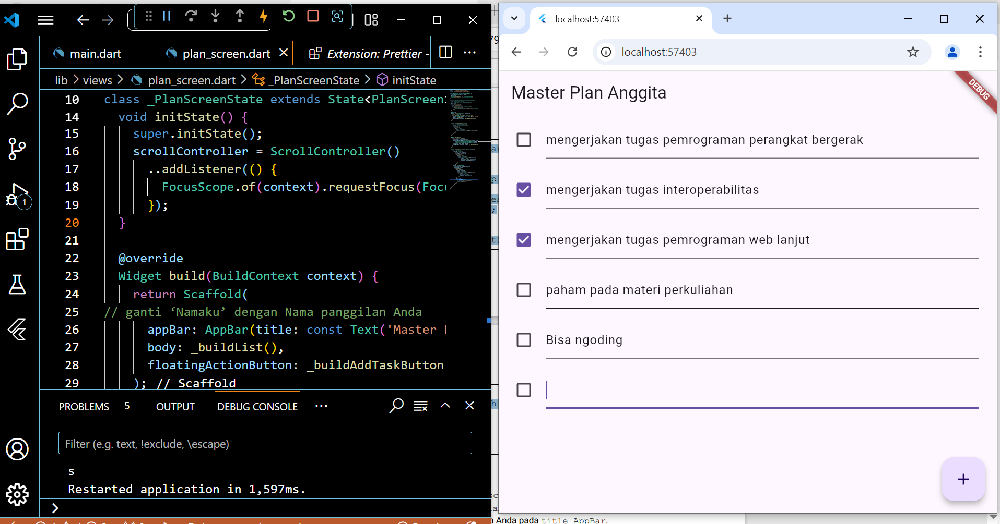

Tugas Praktikum 1: Dasar State dengan Model-View

1. 

2. Jelaskan maksud dari langkah 4 pada praktikum tersebut! Mengapa dilakukan 
demikian?
jawab:
Langkah 4 bertujuan untuk membuat sebuah file data_layer.dart yang digunakan sebagai "hub" untuk mengelola impor model-model yang dibutuhkan, seperti plan.dart dan task.dart. Dengan cara ini, ketika aplikasi berkembang dan semakin banyak model atau data layer yang diperlukan, kita tidak perlu mengimpor setiap model secara individual di setiap file yang membutuhkan.Cukup dengan satu baris: "import 'models/data_layer.dart';"
alasan dilakukan langkah ini:
- Menyederhanakan Proses Impor
Jika setiap model diimpor secara individual, setiap file yang membutuhkannya akan memerlukan banyak baris import. Dengan data_layer.dart, kita dapat menggabungkan beberapa model ke dalam satu file, membuat proses impor menjadi lebih ringkas.
- Meningkatkan Struktur dan Keterbacaan Kode
Pendekatan ini membantu menjaga struktur kode yang lebih teratur dan menghindari duplikasi. Ini membuat kode lebih bersih dan mudah dibaca.
- Mempermudah Pemeliharaan
Saat aplikasi bertambah besar, kita mungkin menambahkan model-model baru. Dengan pendekatan ini, kita cukup memperbarui data_layer.dart agar ekspor model terbaru tersedia untuk seluruh aplikasi, tanpa perlu mengubah setiap file yang mengimpor model tersebut.

3. Mengapa perlu variabel plan di langkah 6 pada praktikum tersebut? Mengapa dibuat konstanta ?
variabel plan digunakan untuk menyimpan instance dari kelas Plan, yang kemungkinan merupakan model data yang mewakili rencana atau daftar tugas yang akan ditampilkan di layar PlanScreen. 

4. Apa kegunaan method pada Langkah 11 dan 13 dalam lifecyle state ?
Pada langkah 11 dan 13 dalam kode tersebut, terdapat dua metode lifecycle penting untuk widget stateful di Flutter: initState dan dispose. Keduanya digunakan untuk menginisialisasi dan membersihkan resource, terutama untuk objek yang memerlukan manajemen khusus seperti ScrollController